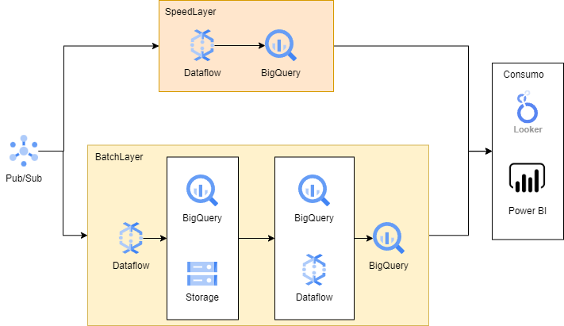

# Arquitetura

## Definição do modelo de arquitetura

Para a integração do sistema do cliente com a Vtex, sujiro primeiro a adoção de um modelo de arquitetura para posterior escolha dos serviços. Pensando no case apresentado, a sugestão é a utilização do modelo de arquitetura Lambda (ilustrado na imagem abaixo), que provê duas camadas de processamento de dados, uma camada para processamento em batch e outra para processamento streaming. 

A camada streaming pensada para dados que necessitam de uma consulta em tempo real. Por exemplo, se o cliente tiver como requisito de implementação que seus vendedores possam consultar as interações do cliente com seu ecommerce em tempo real, afim de que o vendedor entenda se minutos antes de entrar na loja, o consumidor pesquisou algum produto no ecommerce e está indo conferir o preço ou disponibilidade dele na loja física.

Já a camada em batch, para processamento em lote de informações que não necessitam de uma tempestividade tão alta. Como os dados para a loja, que recebe sugestões diárias de contato e informações sobre as campanhas. Esses dados não precisam ser processados e disponibilizados em tempo real e podem ter um delay maior sem prejudicar o negócio.

## Arquitetura Proposta

## Explicação

- **Recibimento dos dados**: Para o recebimento dos dados, pode-se utilizar o serviço Pub/Sub do GCP, caso não haja uma integração nativa entre o ambiente GCP e a Vtex. De modo que o cliente envie proativamente mensagens através de tópicos Pub/Sub a respeito dos dados a serem transferidos;
- **Processamento streaming**: Para realizar o processamento de dados streaming, é possível utilizar o serviço Dataflow para recuperar, processar e enviar os dados para um serviço de armazenamento. O Dataflow foi escolhido por ser um serviço de alta capacidade de redimensionamento, preparado para lidar com aumento e redução nas cargas de trabalho;
- **Armazenamento streaming**: Para armazenamento dos dados streaming, o serviço sugerido é o BigQuery, devido a fonte de dados fornecer dados estruturados, existe uma complexidade baixa em armazenar os dados em estruturas tabulares. Além disso, o BigQuery fornece um ambiente escalável para consultas dos aplicativos ou usuários que desejam consumir o dado, sem a necessidade de gerenciamento de infraestrutura, reduzindo o esforço de manutenção e garantindo uma estruturação de dados performática para consultas analíticas, como a estruturação de bases que respeitem a estrutura dos cubos OLAP;
- **Primeiro processamento em batch**: Nesse estágio, também é recomendado na arquitetura proposta a utilização do Dataflow, semelhante ao processamento em streaming, armazenando dados oriundos de mensagens no Pub/Sub;
- **Primeiro amazenamento em batch**: Nesse estágio, é possível optar por dois tipos de serviços, sendo eles o BigQuery e o Cloud Storage. É interessante que para uma primeira camada de armazenamento em batch, os dados estejam com o menor processamento possível, de modo a refletir fielmente os dados recebidos pelo sistema da Vtex. A razão disso é a garantia do histórico de dados, de modo que, caso ocorra algum erro durante o processamento, é possível voltar para os dados armazenado nessa primeira fase e reprocessá-los sem recorrer ao sistema principal. Nesse contexto, o Google Cloud Storage pode ser utilizado para armazenar os dados em arquivos, sua principal vantagem é que os arquivos podem ser compactados, ocupando menos espaço em disco, e para arquivos pouco consultados, é possível realizar a transferência para classes de armazenamento mais baratas, reduzindo o custo de manter o dado salvo. Já o BigQuery também pode ser utilizado, como o intuito é que nesse estágio o dado possua o menor processamento possível, as tabelas no BigQuery seriam equivalentes, ou perto disso, das tabelas originais da Vtex, a principal vantagem de armazenar os dados no BigQuery em relação do Cloud Storage é a de que os dados no BigQuery podem ser consultados através de consultas SQL, ideal para times de cientistas de dados que desejam explorar os dados originais, antes de sofrer tratamento, transformações ou agregações, afim de criar novos modelos de aprendizado de máquina ou análises. O BigQuery também tem como vantagem a possibilidade de processar os dados dentro da própria ferramenta. Uma vez que os dados estão armazenados aqui no primeiro estágio, é possível utilizar a linguagem SQL para realizar seu processamento e tratamento posterior, além das agregações;
- **Segundo processamento em batch**: Nessa camada, a ideia é que os dados passem por etapas de processamento, tratamento e agregações, de modo a estarem preparados para ingestão em um Data Warehouse para consumo analítico. Dentro deste cenário é possível utilizar duas ferramentas. Caso os dados já estejam armazenados no BigQuery, é possível utilizar a própria ferramenta e linguagem SQL para realizar os tratamentos necessários (dentro do Google Cloud, há também a possibilidade de criar pipelines de SQL dentro do Dataform, estabelecendo uma sequência de consultas a serem executadas, e orquestradas pelo Google Workflows). Caso os dados estejam armazenado no Cloud Storage, o recomendável pela arquitetura é que o pipeline de processamento ocorra pelo Dataflow, que será responsável por processar os dados e armazená-los no Data Warehouse do BigQuery. É altamente recomendável que os pipelines de processamento de dados do Dataflow possuam uma etapa final de validação, afim de conferir se todas as transformações foram bem sucedidas e se a quantidade de dados na saída do processo corresponde ao esperado. Caso a ferramenta escolhida seja o BigQuery, também é possível criar consultas de validações através do Dataflow.
- **Armazenamento (Data Warehouse)**: Na última camada de armazenamento Batch, o sugerido é o serviço de BigQuery para criação de um Data Warehouse. A estrutura de Data Warehouse é recomendada para o caso, pois os dados recebidos são dados estruturados e uma modelagem de dados em Star Schema ou Snow Flake Schema pode beneficiar as consultas analíticas dos dados por seus consumidores, otimizando a performance da consulta e, com o auxílio do BigQuery, provisionando uma escalabilidade sem a necessidade da ocupação do time técnico com o gerenciamento de recursos.
- **Camada de consumo**: A última camada do modelo, nele não é sugerido nenhum tipo de ferramenta, pois a arquitetura proposta deve ser capaz de se vincular a qualquer ferramenta de visualização e consumo de dados para que os usuários de negócio possam analisá-los.